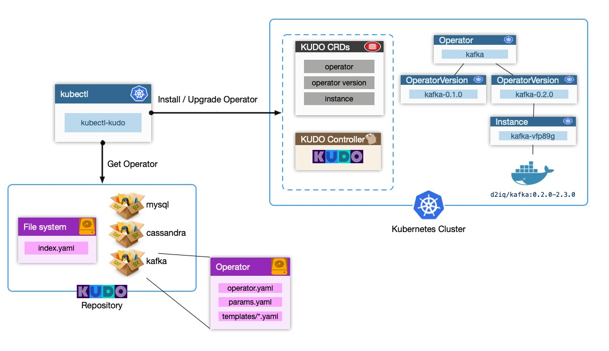
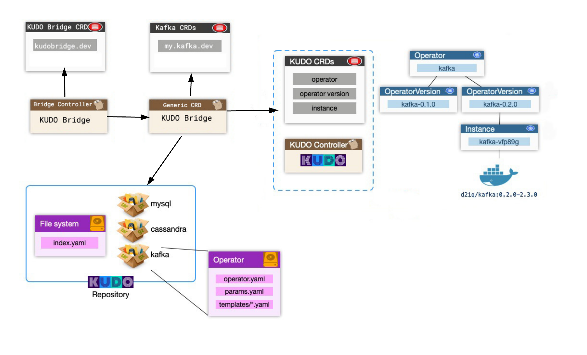

# KUDO Bridge

KUDO Plugin to write operators based on any CRDs

Read more about [KUDO](kudo.dev)

## Overview

KUDO enables developers to write declarative operators 

The KUDO CRDs are the native way to develop operators using KUDO. Where KUDO CRDs of `operator`, `operatorversion` and `instance` are used to develop and manage the operator. 

KUDO Bridge enhances the KUDO Operators to enable the use of any CRD to define the Operator lifecycle

Check out the [examples](./examples) 

